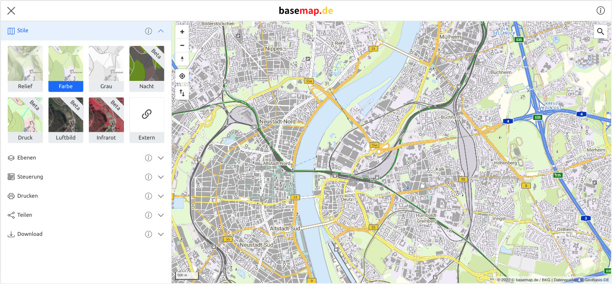

# basemap.de Viewer

Web application to view, edit and print vector tile maps, based on [Angular](angular.io) and [MapLibre GL JS](https://github.com/maplibre/maplibre-gl-js).

Try the application: [https://basemap.de/viewer](https://basemap.de/viewer)



## Getting Started

To set up the development environment for basemap.de viewer on your local machine you can follow these instructions. You can alternatively create a Docker image as you can see below.

### Prerequisites

To get the viewer up and running locally you first need to install a current [Node.js LTS](https://nodejs.org/) version and [Angular CLI](https://angular.io/cli).

If you want to include the address search, you need a geocoder service.

### Installation

Clone this respository and install the dependencies:

```
npm install
```

Run basemap.de viewer on port 4200:

```
npm start
```

Test the application:

```
npm test
```

Select a build configuration fom [package.json](package.json) or define your own build configuration in [angular.json](angular.json) and run the appropriate build command.

```
npm run build-adv-dev
```

## Docker

Build a Docker image:
```
docker build -t bm_viewer .
```

Start a container with basemap.de viewer:
```
docker run --rm --name bm_viewer -p 4200:4200 bm_viewer:latest
```

## Configuration

You can configure the application in the [environment.ts](src/environments/environment.ts). More details can be found in the [configuration](docs/configuration.md) documentation.


## License
Licensed under the European Union Public License (EUPL). For more information see [LICENSE.txt](LICENSE.txt).

Copyright 2022 Landesamt für Geoinformation und Landesvermessung Niedersachsen
