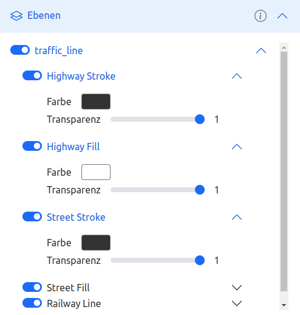
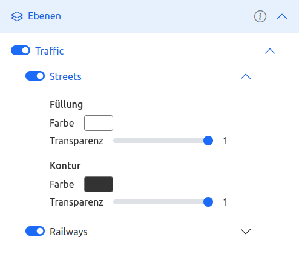

# Customize the layer tree by individual layer groups

## Default behavior

By default, the layers in the layer tree are grouped based on their _source-layer_ attribute. All layers with the same _source-layer_ are grouped into a layer group with the value of _source-layer_ as label. Within these groups all layers are listed individually with their _id_ and can be edited.

The following example shows the layers of a vector tile style that all have the same _source-layer_. In the user interface, these layers are grouped in "traffic_line", in the order of their appearance in the style file.

__Style JSON__
```json
"layers": [
    {
        "id":"Highway Stroke",
        "type":"line",
        "source": "vt-source",
        "source-layer": "traffic_line",
        "paint": {
            "line-width": 10,
            "line-color":"#333333"
        }
    },
    {
        "id":"Street Stroke",
        "type":"line",
        "source": "vt-source",
        "source-layer": "traffic_line",
        "paint": {
            "line-width": 7,
            "line-color":"#333333"
        }
    },
    {
        "id":"Highway Fill",
        "type":"line",
        "source": "vt-source",
        "source-layer": "traffic_line",
        "paint": {
            "line-width": 8,
            "line-color":"#FFFFFF"
        },
    },
    {
        "id": "Street Fill",
        "type": "line",
        "source": "vt-source",
        "source-layer": "traffic_line",
        "paint": {
            "line-width": 5,
            "line-color":"#FFFFFF"
        }
    },
    {
        "id":"Railway Line",
        "type":"line",
        "source": "vt-source",
        "source-layer": "traffic_line",
        "paint": {
            "line-width": 1,
            "line-color":"#0000AA"
        }
    }
]
```

__User interface__



## Using metadata for grouping

By an additional metadata file, the grouping and labeling of the layers in the layer tree can be changed. This can provide the user with a more user-friendly and clearer interface for editing layers. The metadata are stored in a JSON file and must be accessible via a URL. To apply the metadata, the attributes _metaDataURL_ and _useMetaData_ must be set in the [configuration](configuration.md).

In this example, highways and streets are combined to one group layer "Streets". This allows the colors of the fill and contour of both street types to be changed simultaneously. In addition, more readable labels are displayed to the user, e.g. "Traffic" instead of "traffic_line".

__Metadata JSON__
```json
{
    "groups": [
        {
            "name": "Traffic",
            "subgroups": [
                {
                    "name": "Streets",
                    "line": [
                        "Highway Stroke",
                        "Street Stroke"
                    ],
                    "fill": [
                        "Highway Fill",
                        "Street Fill"
                    ]
                },
                {
                    "name": "Railways",
                    "line": [
                        "Railway Line"
                    ]
                }
            ]
        }
    ]
}
```

__User interface__



## Reference

The following attributes can be used in the metadata file.

### groups

`name`: string

Label of the group.

`subgroups`: array of objects

Assignment of style layers to the group.

### subgroups

Subgroups are displayed as layers in the layer tree. All subgroups are assigned style layers for which attributes such as color and visibility can be changed simultaneously. Style layers that are not listed in any subgroup are not displayed in the layer tree and cannot be edited.

`name`: string

Label of the subgroup.

`line`: array of strings

Optional, if _fill_ or _symbol_ is set. List of _id_ of style layers grouped in "Kontur" (contour) in the layer tree.

`fill`: array of strings

Optional, if _line_ or _symbol_ is set. List of _id_ of style layers grouped in "Füllung" (fill) in the layer tree.

`symbol`: array of strings

Optional, if _line_ or _fill_ is set. List of _id_ of style layers grouped in "Beschriftung" (label) in the layer tree.

